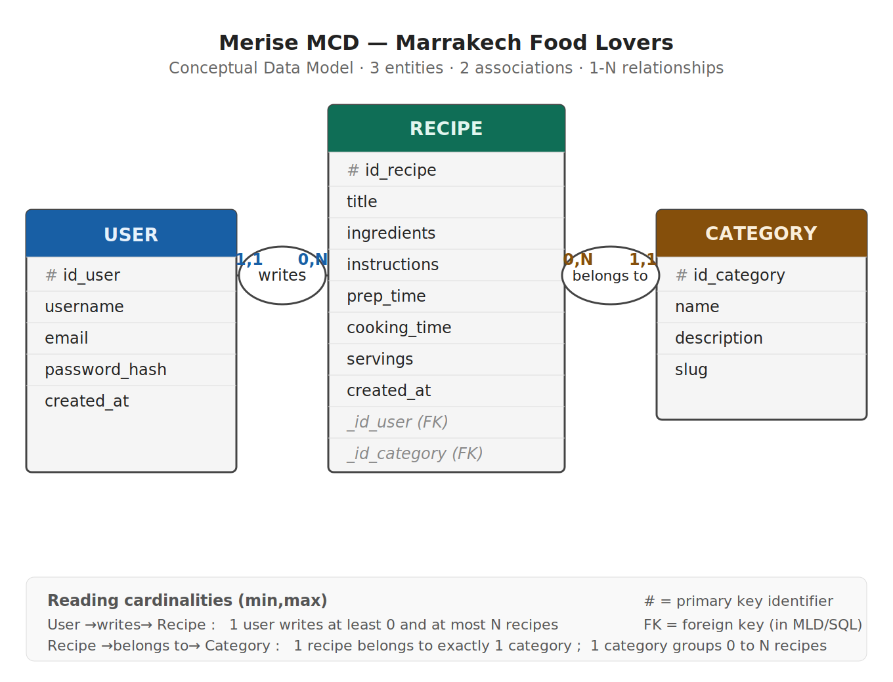
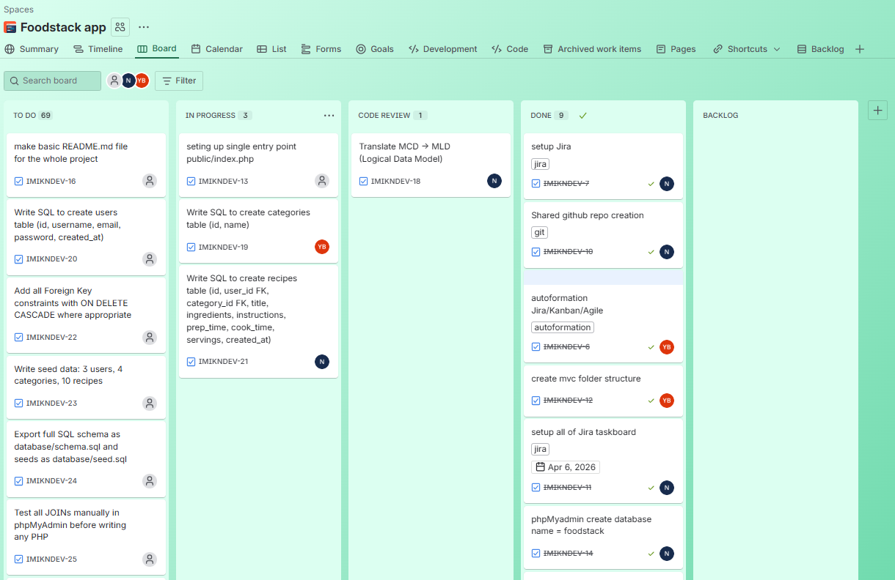

# 🍽️ Foodstack — Recipe Sharing Platform

> **Welcome to Foodstack**, a project executed by the **DigitalBite Agency** to centralize culinary creations in a single, secure, and professional platform.

---

## 🏢 Project Context

The **DigitalBite Agency** specializes in creating applications for the culinary industry. Our client, **Marrakech Food Lovers**, needs to solve a growing problem: beloved recipes are currently scattered across paper notebooks, phone photos, and disorganized Word files, making sharing and access within the community almost impossible.

### ⚠️ The Problem
- **Fragmentation**: Recipes are stored in various non-standard formats.
- **Inaccessibility**: Hard to find and search for a specific dish.
- **No Community**: No way to share and organize recipes among enthusiasts.

### 🚀 The Solution
A centralized, professional web platform built with a robust **MVC (Model-View-Controller)** architecture to ensure data integrity and ease of use.

---

## 👨‍💻 Backend Developer Role & Architecture

Our role as Backend Developers focuses on high-standard software engineering:
- **Architecting the MVC Flow**: Complete isolation of responsibilities. Orchestrating data without compromise between the Model and the View via the Controller.
- **OOP Encapsulation**: Shielding data access with `private` properties and standardizing interaction through public `Getters/Setters`.
- **SQL Data Engineering**: High-fidelity modelling of **1-N relationships** (Users to Recipes, Categories to Recipes) with full referential integrity.
- **Operational Agility**: We use the **Kanban methodology** via **Jira** to track progress and sync during **Daily Standups**.
- **Merise Method**: Structural analysis using **MCD** (Conceptual Data Model) and **MLD** (Logical Data Model) before starting the development phase.

---

## 📋 User Stories (Business Needs)

| ID | User Story | Description |
|:---|:---|:---|
| **US1** | **User Registration** | As a visitor, I want to create an account to manage my recipes. |
| **US2** | **User Login** | As a registered user, I want to log in to access my personal space. |
| **US3** | **Show My Recipes** | As a logged-in user, I want to see my recipes (title, prep time, date). |
| **US4** | **Create Recipe** | As a logged-in user, I want to add new recipes with full details. |
| **US5** | **Edit Recipe** | As a logged-in user, I want to modify my existing recipes. |
| **US6** | **Delete Recipe** | As a logged-in user, I want to delete my own recipes. |
| **US7** | **Recipe Categories** | As a user, I want to organize recipes by Starters, Main, Desserts, and Drinks. |
| **US8** | **Filter by Category** | As a user, I want to browse my recipes by their specific category. |
| **Bonus** | **[Selection]** | Includes one extension (Search, Favorites, Total Time, or Ratings). |

---

## 📐 Structural Analysis (Merise)

Below is the **Conceptual Data Model (MCD)** representing our data architecture, associations, and cardinalities.



---

## 📊 Jira Board (Agile Tracking Kanban framework)


> *Progress is tracked using 4 columns: Backlog, In Progress, In Review, and Done.*

---

## 📁 Project Structure (MVC)

```
foodstack/
├── app/
│   ├── Controllers/       
│   │   ├── AuthController.php    # (US1, US2: Login/Register)
│   │   └── RecipeController.php  # (US3-US8: CRUD & Filtering)
│   ├── Models/            
│   │   ├── User.php              # (Encapsulation: private props & getters/setters)
│   │   ├── Recipe.php            # (SQL: JOINs with Categories)
│   │   └── Category.php          # (SQL: Get all categories)
│   ├── Views/             
│   │   ├── auth/
│   │   │   ├── login.php
│   │   │   └── register.php
│   │   ├── recipes/
│   │   │   ├── recipes.php       # (Show My Recipes list)
│   │   │   ├── create.php        # (Add recipe form)
│   │   │   └── edit.php          # (Edit recipe form)
│   │   ├── header.php            # (Navigation bar)
│   │   └── footer.php            # (Copyright/Scripts)
│   └── Database.php              # Simple PDO connection class
├── public/                
│   ├── css/
│   │   └── style.css
│   └── index.php                 # Front controller (Entry Point)
├── includes/                
│   ├── jira.png
│   └── mcd_merise.png                 
├── config/
│   └── config.php                # DB credentials & constants
└── database/
    ├── schema.sql                # Table creation script (FK constraints)
    └── seed.sql                  # Sample data (Users, Recipes, Categories)
```

---

## 🚀 Installation & Setup

1. **Clone the repository**:
   ```bash
   git clone https://github.com/Ayouub-aj/Foodstack.git
   ```
2. **Database Import**:
   - Create a database named `foodstack`.
   - Import `database/schema.sql` to create tables and constraints.
   - Import `database/seed.sql` to populate sample data.
3. **Configuration**:
   - Open `config/config.php`.
   - Update your local credentials (`DB_HOST`, `DB_NAME`, `DB_USER`, `DB_PASS`).
4. **Run the application**:
   - Point your local server (XAMPP/Laragon) to the `public/` folder.
   - Access via: `http://localhost:8080/projectPHP/Foodstack/public`.

---

## 🛡️ Performance & Security Criteria

- **Zero SQL Injection**: 100% of queries use **PDO Prepared Statements**.
- **Secure Auth**: Passwords are saved using `password_hash()` (BCRYPT) and verified via `password_verify()`.
- **MVC Integrity**: No SQL queries allowed in Views; business logic is restricted to Models.
- **XSS Prevention**: Clean output using `htmlspecialchars()` on all dynamic content.

---

## 👥 Pair Programming Partners

| Member | GitHub |
|:---|:---|
| **[Name 1]** | [@ayouub_aj] |
| **[Name 2]** | [@younesbarrag] |

---

## ⚠️ DigitalBite Agency Golden Rule
---
*Last updated: 04/07/2026*